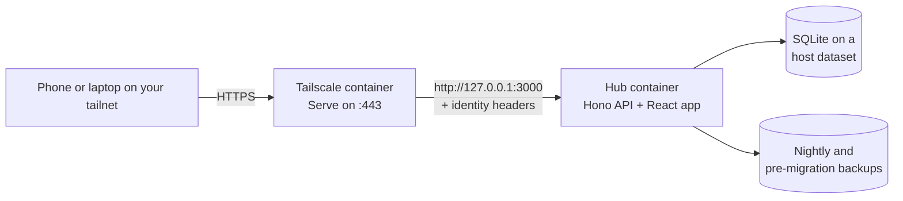

# Hub

A private, self-hosted personal hub: tasks and goals, courses, resale tracking, budgets, and small-business prep in one app that works on a phone and a desktop. It runs as a single container and is reachable only through [Tailscale](https://tailscale.com), with no passwords and no public exposure.

> Status: early. The foundation is done (sign-in, settings, backups, deployment); modules arrive in phases. See [docs/PLAN.md](docs/PLAN.md).

## How it works



- **Sign-in** uses the identity Tailscale attaches to each request; only the configured login gets in.
- **Data** lives in one SQLite file on your server. Nothing personal is ever stored in this repository.
- **Updates** ship as container images. Merging to `main` publishes `ghcr.io/<owner>/<repo>:stable`, and the server redeploys itself when that tag changes.
- **Safety nets:** a backup before every schema change, nightly backups, additive-only migrations, and a one-click rollback workflow.

## Run it locally

```bash
npm ci
cp .env.example .env
npm run dev            # http://localhost:5173
```

`npm run check` runs lint, types, the migration guard, and unit tests. `npm run build && npm run test:e2e` runs the browser tests.

## Deploy

[docs/SETUP.md](docs/SETUP.md) walks through GitHub, Tailscale, TrueNAS (or any Docker host), backups, and adding the app to a phone's home screen.

## Changing it with Claude Code

The repository is set up for [Claude Code](https://code.claude.com): `CLAUDE.md` holds the conventions, and a session hook installs dependencies in cloud sessions. Ask for a change, review the pull request once CI passes, and merge; the server picks up the new build within minutes.

## Stack

TypeScript, React, React Router, TanStack Query, Tailwind CSS, Hono, Drizzle ORM, SQLite (better-sqlite3), Zod, Vitest, Playwright, Biome.

## Credits and license

MIT licensed. Colors adapted from [Catppuccin](https://catppuccin.com) (MIT), with the neutrals shifted to dark blue. Typeface: Manrope (SIL Open Font License).
