# Hub

A private, self-hosted personal hub: tasks and goals, courses, resale tracking, budgets, and small-business prep in one app that works on a phone and a desktop. It runs as a single container and is reachable only through [Tailscale](https://tailscale.com), with no passwords and no public exposure.

> Status: 1.0. Every module in [the plan](docs/PLAN.md) is built. Changes are listed in [CHANGELOG.md](CHANGELOG.md).

<p align="center">
  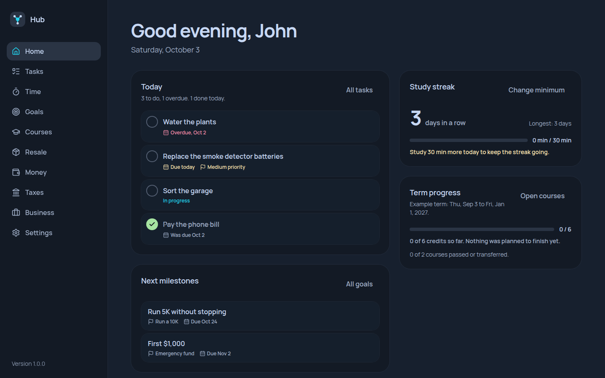
</p>

<p align="center">
  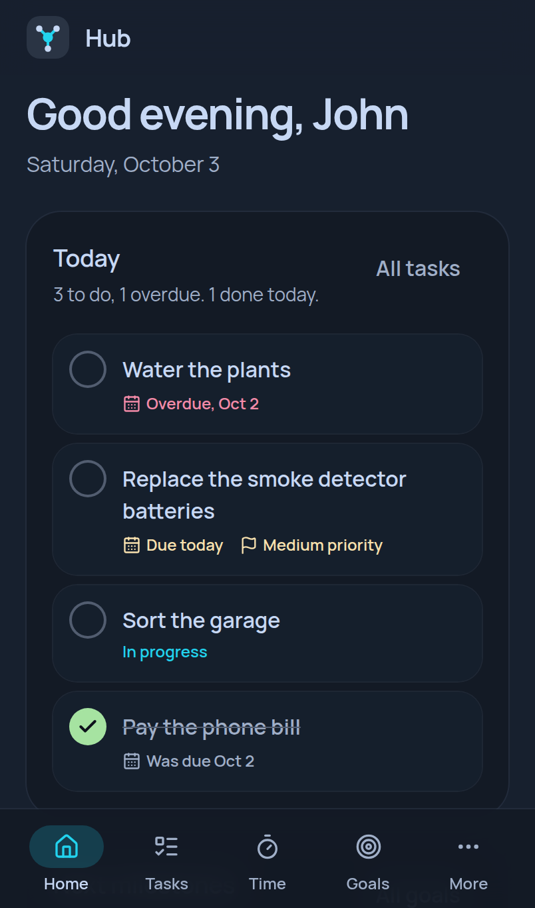
  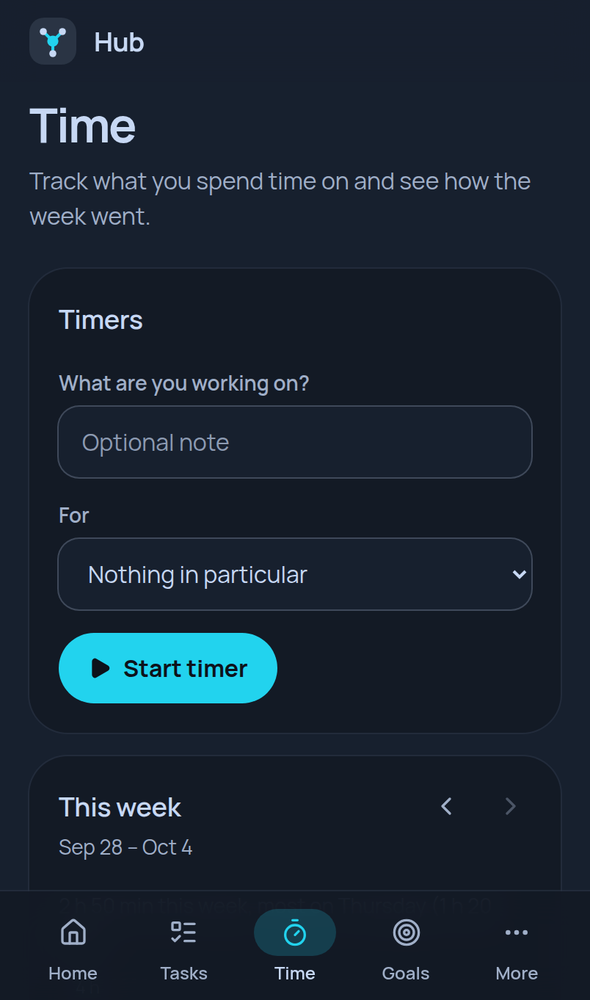
  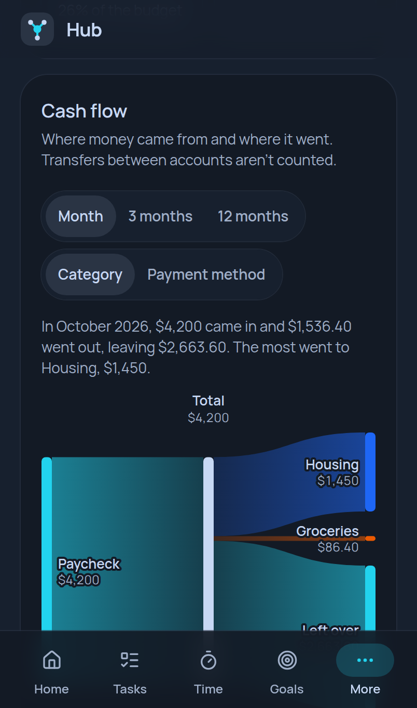
</p>

The screenshots use the example data that setup can add, with made-up names. More are in [docs/screenshots](docs/screenshots).

## What's in it

Each module can be turned off in Settings; its page and home widgets go away with it.

- **Tasks:** projects, a list and a board, subtasks, priorities, due dates, tags, and recurring tasks that create the next one when finished.
- **Time:** several timers at once, manual entries, and a weekly chart. Time can be for a task, a course, a resale item, or a project.
- **Goals:** target dates, milestones, and progress from tasks, milestones, an amount, or a linked savings account, with a timeline.
- **Courses:** terms, courses, credits, assessments, and planned windows on a pacing timeline, plus a study streak from time on courses. Terms can be imported as JSON.
- **Resale:** items from sourcing to sold, costs, listings with price history, profit per item, month, and platform, a buy calculator, CSV import, and a "paste listing" format for a writing assistant or an iOS Shortcut.
- **Money:** books, accounts, and categories; CSV and OFX/QFX imports with duplicate checks and undo; rules, transfer matching, and help sorting what's left (names from payment apps go into the memo); monthly budgets, cash flow, and net worth.
- **Taxes:** a plain-language guide to US federal basics with sources and review dates, plus a resale income summary and a set-aside estimate. It's education, not tax advice.
- **Business:** a phased setup checklist with cost estimates, gear, skills and certifications, a rate calculator, leads, and notes.
- **Around the edges:** reminders and a home summary sent to Home Assistant, an optional calendar feed for dated things, resale items linked to their transactions, nightly backups you can download and restore from Settings, and an accent color.

<table>
  <tr>
    <td>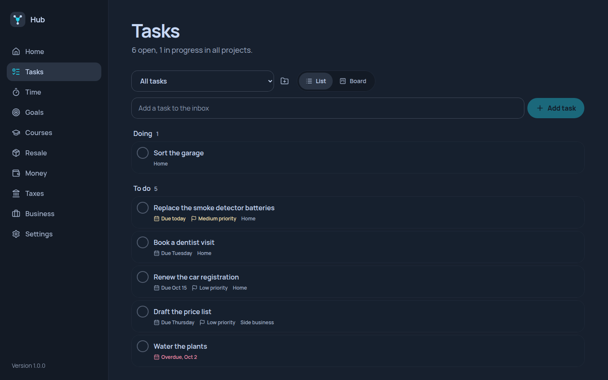</td>
    <td>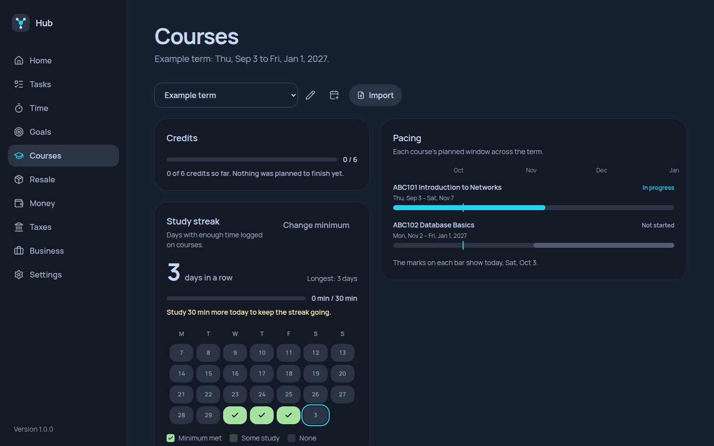</td>
  </tr>
  <tr>
    <td>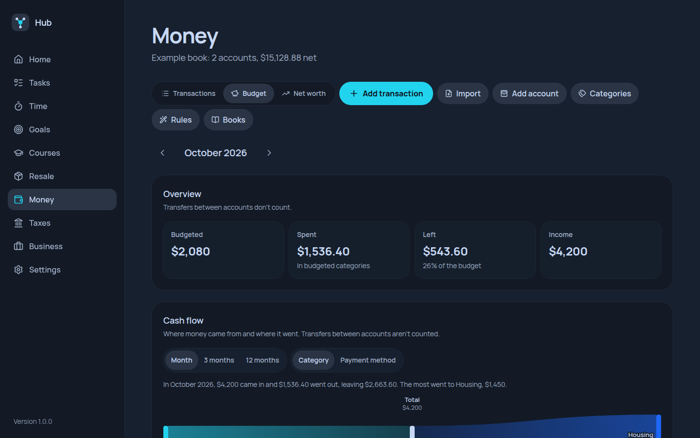</td>
    <td>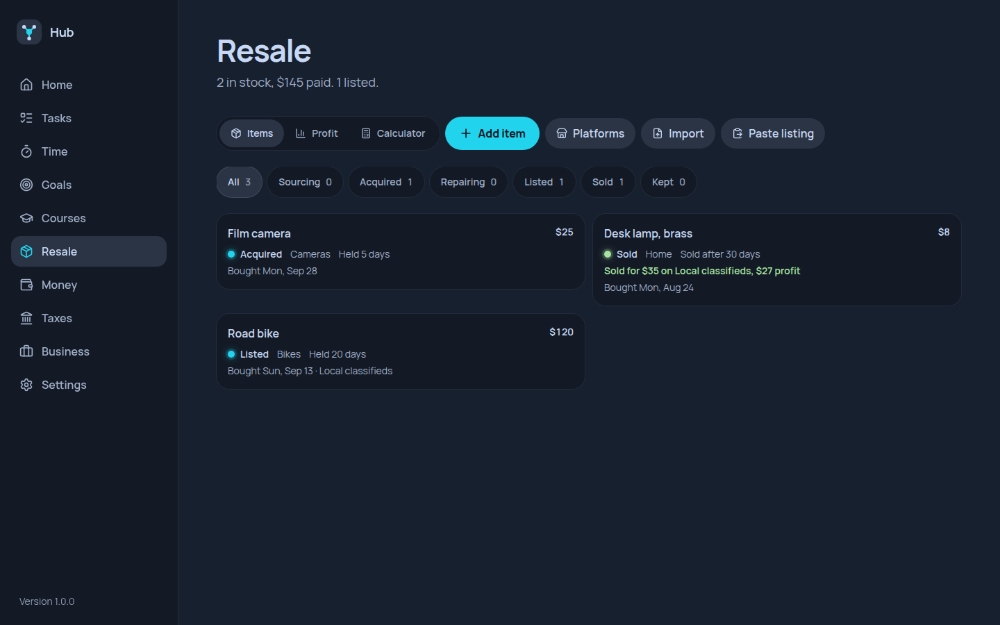</td>
  </tr>
  <tr>
    <td>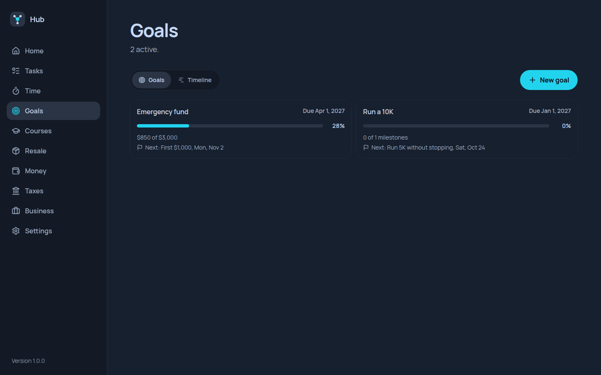</td>
    <td>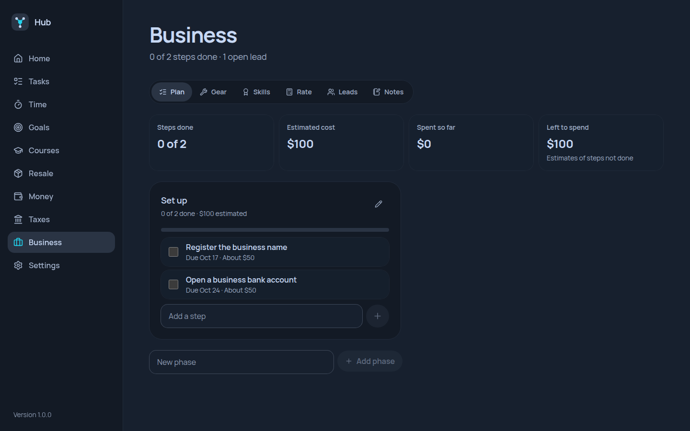</td>
  </tr>
</table>

## How it works

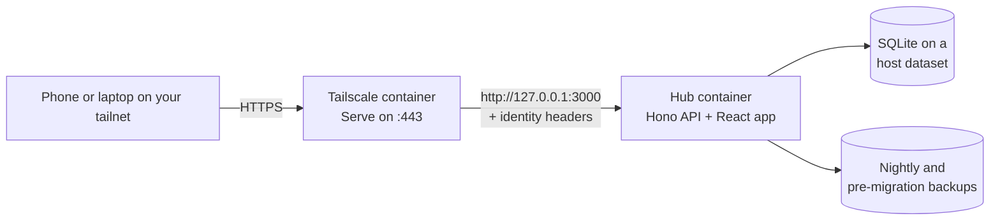
```mermaid
flowchart LR
  phone[Phone or laptop on your tailnet] -- HTTPS --> ts[Tailscale container<br/>Serve on :443]
  ts -- http://127.0.0.1:3000<br/>+ identity headers --> app[Hub container<br/>Hono API + React app]
  app --> db[(SQLite on a<br/>host dataset)]
  app --> backups[(Nightly and<br/>pre-migration backups)]
```

- **Sign-in** uses the identity Tailscale attaches to each request; only the configured login gets in.
- **Data** lives in one SQLite file on your server. Nothing personal is ever stored in this repository.
- **Updates** ship as container images. Merging to `main` publishes `ghcr.io/<owner>/<repo>:stable`, and the server redeploys itself when that tag changes.
- **Safety nets:** a backup before every schema change, nightly backups, additive-only migrations, and a one-click rollback workflow.

## Run it locally

```bash
npm ci
cp .env.example .env
npm run dev            # http://localhost:5173
```

The first visit opens setup: pick modules and a time zone, and add the example data if you want something to click around in. Settings > **Modules and time zone** > **Remove example data** takes it out again, leaving anything you added.

`npm run check` runs lint, types, the migration guard, and unit tests. `npm run build && npm run test:e2e` runs the browser tests. `npm run screenshots` rebuilds and retakes the screenshots above from the example data (set `PLAYWRIGHT_CHROMIUM_PATH` to use a Chromium installed outside Playwright).

## Deploy

[docs/SETUP.md](docs/SETUP.md) walks through GitHub, Tailscale, TrueNAS (or any Docker host), backups, and adding the app to a phone's home screen.

## Changing it with Claude Code

The repository is set up for [Claude Code](https://code.claude.com): `CLAUDE.md` holds the conventions, and a session hook installs dependencies in cloud sessions. Ask for a change, review the pull request once CI passes, and merge; the server picks up the new build within minutes.

## Stack

TypeScript, React, React Router, TanStack Query, Tailwind CSS, Hono, Drizzle ORM, SQLite (better-sqlite3), Zod, Vitest, Playwright, Biome.

## Credits and license

MIT licensed. Colors adapted from [Catppuccin](https://catppuccin.com) (MIT), with the neutrals shifted to dark blue. Typeface: Manrope (SIL Open Font License).
