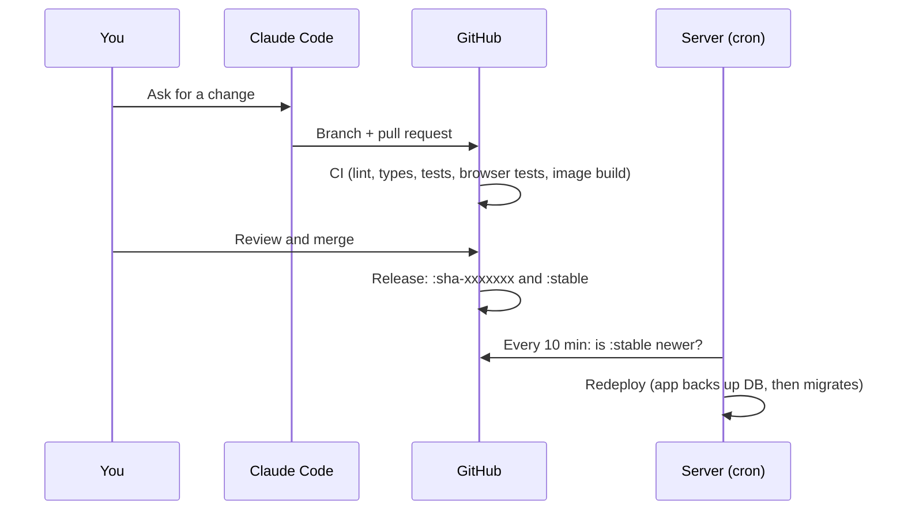

# Plan

The roadmap for Hub, plus the decisions behind it. Each unchecked item is meant to be one pull request.

## Goals

- One private app for tasks and goals, courses, resale tracking, money, and business prep, with everything linkable to everything else.
- Works well on an iPhone (home screen app) and on a desktop.
- Reachable only through Tailscale. No passwords, no public endpoints.
- Easy to change by asking Claude Code for a feature, with CI and backups as guardrails.
- Neutral enough to publish as a template: all personal details live in the database.

## Architecture

| Area | Choice | Why |
| --- | --- | --- |
| Language | TypeScript everywhere | One type system catches API/UI mismatches before merge |
| API | Hono on Node, typed client via `hono/client` | Small, explicit, end-to-end types |
| Database | SQLite (better-sqlite3) with Drizzle ORM | One file on a snapshot-able dataset, generated migrations |
| UI | React, React Router, TanStack Query, Tailwind v4 | Mainstream, fast, easy for Claude to extend |
| Tests | Vitest (unit), Playwright (iPhone + desktop), Biome | Every pull request is checked the same way |
| Delivery | One container on GHCR, Tailscale sidecar, TrueNAS custom app | No inbound ports, no credentials on the server |

### Deployment flow



Rollback: run the **Roll back** workflow with an earlier build id. Because migrations are additive, the older build still works against the newer database. If a migration itself was the problem, restore the matching `pre-migrate-*.sqlite3` backup (see SETUP.md).

## Cross-cutting data model

Modules share a small core so everything can be linked:

- `projects`: a container for tasks (kind: general, course, homelab, business, resale).
- `tasks`: title, notes, status (backlog, todo, doing, done), priority, optional due date, `parent_id` for subtasks, sort order, recurrence rule.
- `goals` and `milestones`: target dates; progress comes from linked tasks, milestones, an amount (money), or manual entry.
- `time_entries`: start, end, minutes, note, and what it was for (task, course, resale item, project).
- `links`: generic `from_type/from_id` to `to_type/to_id` with a relation name, so a task can point at a resale item, a transaction, or a course.
- `tags` and `activity_log` (who changed what and when, for timelines).

Money is always integer cents. Calendar dates are `YYYY-MM-DD` text.

## Phases

### Phase 0: Foundation

- [x] Repository, CI, release and rollback workflows, Dependabot
- [x] Tailscale identity sign-in, cross-site write protection, strict CSP
- [x] SQLite, generated migrations, backup before migrating, nightly backups with retention
- [x] App shell (phone tab bar, desktop sidebar), system status, accent color setting
- [x] TrueNAS compose file, update script, Tailscale policy, setup guide

### Phase 1: Tasks, goals, time, courses

- [x] 1.1 Core tables (projects, tasks with subtasks, tags, links, activity log), API, tests
- [x] 1.2 Tasks UI: list and Kanban board (drag on desktop, move menu on phone), task sheet with subtasks
- [x] 1.3 Recurring tasks (daily, weekly, monthly; the next one is created on completion)
- [x] 1.4 Time tracking: start/stop timer, manual entries, weekly chart
- [x] 1.5 Goals and milestones with target dates, progress, and a timeline view
- [x] 1.6 Courses: terms, courses, credits, assessments, planned windows; `hub-education/v1` import; pacing timeline with a today marker
- [x] 1.7 Study streak: days meeting a minimum of study minutes (setting), from time entries on courses
- [ ] 1.8 Home widgets: today's tasks, study streak, next milestones, term progress

### Phase 2: Resale

- [ ] 2.1 Items with status (sourcing, acquired, repairing, listed, sold, kept), purchase details, platforms kept in the database
- [ ] 2.2 Costs per item (parts, fees, shipping, supplies) and time spent (from time entries)
- [ ] 2.3 Listings with price history, sale details, buyer notes, days held
- [ ] 2.4 Profit, margin, and profit per hour; charts by month and platform
- [ ] 2.5 CSV import with column mapping; incomplete rows flagged "needs review"
- [ ] 2.6 "Paste listing" import (`hub-listing/v1`) and a JSON endpoint for an iOS Shortcut
- [ ] 2.7 Basic buy calculator: expected price, fees, repair estimate, and target margin give a maximum offer; uses your history when available

### Phase 3: Money and tax guide

- [ ] 3.1 Books (personal and business), accounts, categories, transactions
- [ ] 3.2 File imports: CSV with saved column mappings, OFX/QFX; duplicate detection; undo an import
- [ ] 3.3 Categorization rules and transfers
- [ ] 3.4 Monthly budgets per category with remaining amounts and charts
- [ ] 3.5 Savings goals linked to accounts; balance snapshots for accounts without exports
- [ ] 3.6 Net worth over time
- [ ] 3.7 Link resale purchases and sales to transactions
- [ ] 3.8 Tax guide: plain-language US federal lessons with sources and review dates, plus a resale income summary and set-aside estimate (education, not tax advice)

### Phase 4: Business prep, integrations, template

- [ ] 4.1 Business prep: phased checklist with costs, gear inventory, skills and certifications, rate calculator, leads, notes
- [ ] 4.2 Home Assistant: push a summary (study streak, today's tasks, upcoming dates) and reminders to Home Assistant webhooks
- [ ] 4.3 Reminder scheduler: daily digest, due soon, streak at risk
- [ ] 4.4 Optional token-protected calendar feed (ICS)
- [ ] 4.5 First-run setup (modules, time zone), module on/off setting, demo data with neutral examples
- [ ] 4.6 Screenshots from demo data, docs polish, v1.0 release

## Import formats

### `hub-education/v1`

```json
{
  "format": "hub-education/v1",
  "terms": [
    {
      "name": "Term 1",
      "startDate": "2030-01-01",
      "endDate": "2030-06-30",
      "creditGoal": 6,
      "courses": [
        {
          "code": "ABC101",
          "title": "Introduction to Networks",
          "credits": 3,
          "status": "in_progress",
          "plannedStart": "2030-01-01",
          "plannedEnd": "2030-03-15",
          "assessments": [
            { "kind": "exam", "label": "Exam" },
            { "kind": "project", "label": "Project" }
          ]
        }
      ]
    }
  ]
}
```

`status` is one of `not_started`, `in_progress`, `passed`, `transferred`. `kind` is `exam`, `project`, or `other`; `label` is free text.

### `hub-listing/v1`

Produced by a writing assistant at the end of a listing, pasted into the app (or sent by a Shortcut).

```json
{
  "format": "hub-listing/v1",
  "item": { "title": "Stereo receiver", "brand": "Example", "model": "RX-100", "condition": "used" },
  "listing": { "platform": "Local classifieds", "price": 150, "title": "Stereo receiver, works great", "description": "..." },
  "purchase": { "price": 60, "date": "2030-01-10", "source": "Garage sale" }
}
```

Prices are in dollars in this format and stored as cents. Missing fields are allowed; the item is flagged for review.

## Integrations

- **Home Assistant (Phase 4):** the app sends JSON to Home Assistant webhooks over the local network. A trigger-based template sensor turns the summary into entities, and an automation turns reminders into phone notifications. Webhook IDs stay in the server's environment. Home Assistant needs no access to the app and the app needs no Home Assistant token.
- **Phone shortcuts:** an iOS Shortcut can POST JSON to the app over Tailscale; requests without browser headers are allowed by the cross-site guard, and identity still comes from Tailscale.
- **AI chat assistants** run on their providers' servers and can't reach a tailnet-only app. Use the paste import or a Shortcut instead of exposing the app publicly.

## Privacy rules for this repository

- No personal details anywhere in the repository, commit metadata, or pull requests (see CLAUDE.md).
- Commit with a GitHub-provided no-reply email.
- Owner-specific settings (login, time zone, paths, keys) live only in the server's app configuration.
- Personal data files (imports, exports) never go in the repository; `private/` is ignored as a safety net.

## Known issues

- `npm audit` reports a moderate advisory in an old `esbuild` inside `drizzle-kit`'s dependencies. It affects esbuild's development server, which isn't used; `drizzle-kit` is a development tool and isn't in the production image.
